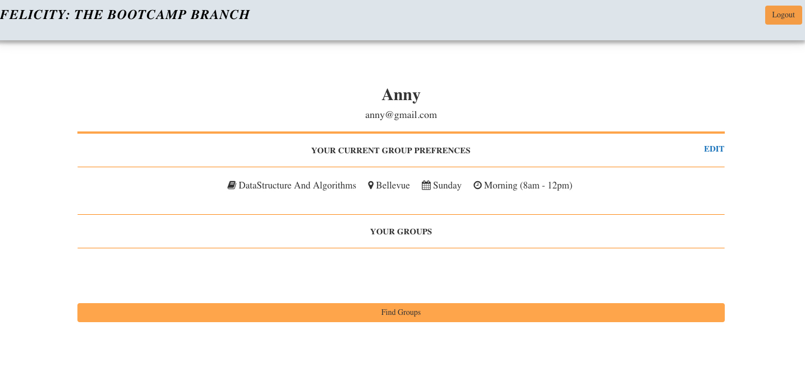

# Project-2: Felicity The Bootcamp

## Team Defenders
* Team Members
  * Ali Atri
  * Anny Huynh
  * Blake Mosebar
  * Cat Cohen
  * Mandeep Kaur

## Project Description
* Our intent for this project is to create something that the class can use in the future. * Our incentive - our project is centered around innovation. Up until we were assigned study groups people were so reluctant to join study groups When the users sign up they can answer questions - prior experiences - where youre located - what part of coding you're interested in - whats your sign - what languages do you speak 

## Project Requirements 

* Must use a Node and Express Web Server - user should be able to input something and see it display (get and post)
* Must have both GET and POST routes for retrieving and adding new data
* Must be deployed using Heroku (with data) - 
* Must utilize at least one new library, package, or technology that we haven't discussed -  npm package
* Must have published frontend / UI - at first we keep our front end pretty simple - keep it simple 
* Must have folder structure that meets MVC Paradigm - keeping organized - sticking to format
* Must meet good quality ccoding standards (indentation, scoping, naming)
* Must protect API keys in node with environment variables
* ((((put "es lint rc" in the repo so code stays consistent))))

### Overall Concept
* Website for student to register and schedule to meet up. 

* Main Features
   * Answer Survey questions 
   * Show available in student profile
   * Find and schedule group for students 

## Web Page Layout
1. Main page
1. User Login & Register Page
1. Student Profile
1. Edit to answer survey questions 
1. Find Group (matching info)

## Deployment
* Heroku
   * https://felicity-bootcamp.herokuapp.com/  
     
     
     

## Repository
* [Anny's GitHub](https://github.com/AnnyHuynh/Felicity-The-BootCamp.git)

## Technology / NPM Packages Used
```
  "bcrypt-nodejs": "0.0.3",
    "body-parser": "^1.18.3",
    "dotenv": "^6.0.0",
    "express": "^4.16.4",
    "express-handlebars": "^3.0.0",
    "express-session": "^1.15.6",
    "mysql": "^2.16.0",
    "mysql2": "^1.6.5",
    "passport": "^0.4.0",
    "passport-local": "^1.0.0",
    "sequelize": "^4.42.0"
```
## Project Page
* wiki: https://annyhuynh.github.io/Felicity-The-BootCamp/
